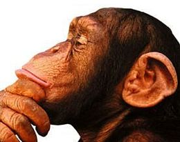
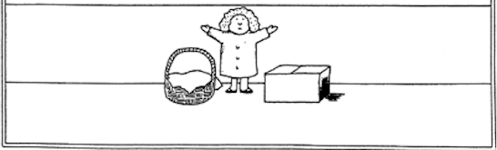

class: middle, center, title-slide
count: false

# Advanced Machine Learning

.bold[Paper]: Neil C. Rabinowitz et al.,  .italic[Machine Theory of Mind], 
in International Conference of Machine Learning 2018.

  
Aurélien Werenne 

---

class: middle, , black-slide

.center.width-70[]

---

# Theory of Mind

  
.center.width-35.circle[]
  
*Theory of Mind* refers to the ability to infer the **mental states of other individuals**, including their intentions, beliefs and desires.

---

# Sally-Anne test

     
.center.width-55[]

.center[This is Sally &#160;&#160;&#160;&#160;&#160;&#160;&#160;&#160;&#160;&#160;&#160;&#160;&#160;&#160;&#160;&#160;&#160;&#160;&#160;&#160;&#160;&#160;&#160;&#160;&#160;&#160;&#160;&#160;&#160;&#160;&#160;&#160;&#160;&#160; This is Anne]

---

# Sally-Anne test

     
.center.width-55[]

.center[Sally puts her ball in the basket] 

---

# Sally-Anne test

     
.center.width-55[]

.center[Sally goes away] 

---

# Sally-Anne test

     
.center.width-55[]

.center[Anne moves the ball to her basket] 

---

# Sally-Anne test

     
.center.width-55[]

.center[Where will Sally look for her ball?] 

---

class: middle

# **Machine** Theory of Mind

---

# Formalism
   
.center.width-85[]

---

# Formalism
   
.center.width-85[]

---

# Architecture

  
.center.width-65[]

---

# Architecture

  
.center.width-65[]

---

class: middle

# Experiments

---

# Experiment III

  
.center.width-85[]

---

# Experiment IV

.center.width-75[]

---

# Experiment IV (continued)

   
.center.width-85[]

---

# Pros & cons

   
<dl>
  <dd>+  General Framework</dd>
  <dd>+  Meta-Learning</dd>
</dl>
 
<dl>
  <dd>-  Hard-coded knowledge</dd>
  <dd>-  Passive observer</dd>
</dl> 

---

class: end-slide, center
count: false

The end.
